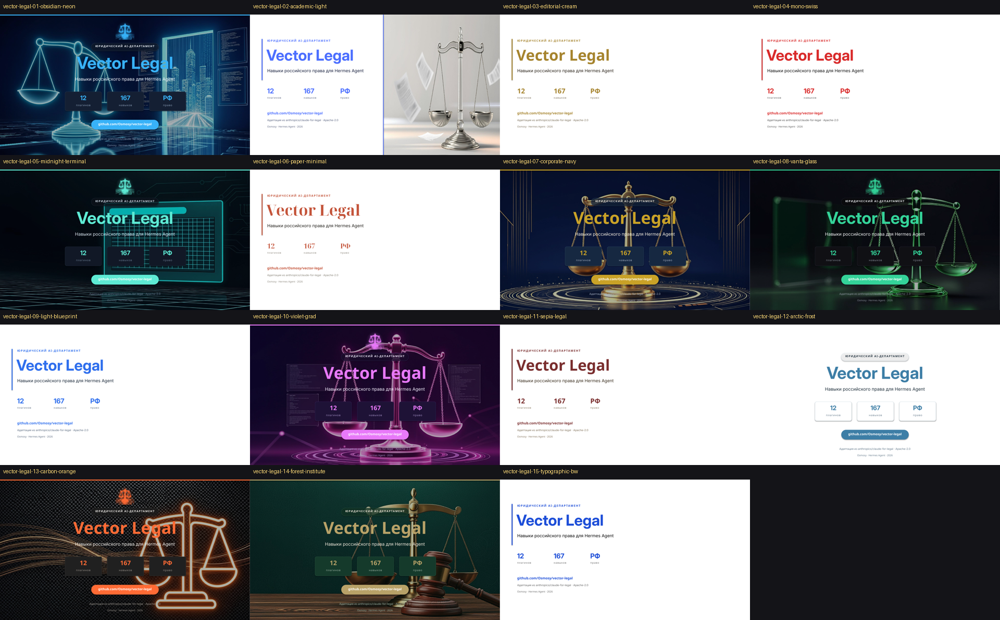

<p align="center"></p>

# Vector Deck Themes — 15 тем презентаций Vector

Тема-движок для дек экосистемы Vector (Osmosy). Один `engine.py` = 15 готовых
дизайн-тем (7 тёмных, 8 светлых) + контент + билдер. Любая Vector-презентация
собирается одной командой; темы переиспользуются между проектами.

**Правило полного цикла:** в деке нового проекта переработка ПОЛНАЯ —
сохраняется только тема (палитра/шрифты/композиция); hero-арт, эмблема,
kicker и подписи генерируются заново под тему проекта.



## Каталог тем

| # | Тема | Режим | Стиль | Для чего |
|---|------|-------|-------|----------|
| 00 | v2-original | тёмная | эталон: неоновые весы, тёмно-синий | оригинал, с которого сделаны все темы |
| 01 | obsidian-neon | тёмная | неон-синий на тёмно-синем | база Vector Legal v2, питчи |
| 02 | academic-light | светлая | мягкий свет, стеклянные весы | рабочие доки, референс заказчика |
| 03 | editorial-cream | светлая | крем + Playfair + шалфей | консалтинг, эссе |
| 04 | mono-swiss | светлая | швейцарский моно, красный | строгая типографика |
| 05 | midnight-terminal | тёмная | графит + тил, JetBrains Mono | dev-инструменты |
| 06 | paper-minimal | светлая | тёплая бумага, serif, терракота | консалтинг |
| 07 | corporate-navy | тёмная | полуночь + золото, Playfair | юрфирма, формальные показы |
| 08 | vanta-glass | тёмная | vantablack + изумруд | premium showcase |
| 09 | light-blueprint | светлая | чертёжный серый, сетка | техдоки, схемы |
| 10 | violet-grad | тёмная | фиолетовый неон, Unbounded | смелый showcase |
| 11 | sepia-legal | светлая | сепия архива + бордо | исторический/архивный контент |
| 12 | arctic-frost | светлая | арктический голубой | универсальная светлая |
| 13 | carbon-orange | тёмная | карбон + оранжевый | индустриальный |
| 14 | forest-institute | тёмная | изумруд + латунь | институтский/научный |
| 15 | typographic-bw | светлая | ч/б + один синий | минимализм |

`00-v2-original` — эталонная дека, с которой снимались темы: в `engine.py` её нет
(там 15 тем, 01–15), в репо лежит только готовый `vector-legal-00-v2-original.pptx`.

Полные рендеры каждой темы — в `render/<theme>/slide-01..12.png`.

## Структура

```
engine.py          темы (THEMES), компоненты, контент s_*, билдер
deck_builder.py    универсальная сборка: deck-<project>.py + тема
deck-music.py      референс дека на другую тему (Vector Music)
render_all.sh      рендер всех дек + контактные листы
build_review.py    HTML-ревью (review.html)
render/            PNG-рендеры: 15 тем × 12 слайдов
vector-legal-*.pptx   15 дек Vector Legal (базовый контент)
vector-music-*.pptx   тест универсальности (Vector Music)
tests/smoke_build.py  сборка всех тем с заглушками ассетов + проверка колонтитулов
```

## Быстрый старт

```bash
# склонировать и собрать все 15 дек
git clone https://github.com/Osmosy/vector-deck-themes.git
cd vector-deck-themes
~/.venvs/pptx/bin/python engine.py

# одна тема
~/.venvs/pptx/bin/python engine.py 07-corporate-navy

# рендер + контактные листы
bash render_all.sh

# дымовая проверка (то же гоняет CI): все темы + deck-music, колонтитулы
python tests/smoke_build.py
```

Зависимости: Python 3.11+, `pip install python-pptx Pillow numpy`,
рендер — LibreOffice (`soffice`) + `pdftoppm` (пакет `poppler-utils`).

Пути — через окружение (по умолчанию как раньше):

| Переменная | По умолчанию | Что |
|---|---|---|
| `VECTOR_DECK_ASSETS` | `/tmp/vl_assets` | hero-арты и эмблемы (вне репо) |
| `VECTOR_DECK_OUTDIR` | `~/projects/vector-legal-decks15` | куда пишутся деки и рендеры |
| `VECTOR_DECK_ENGINE` | `engine.py` рядом с билдером | движок для `deck_builder.py` |
| `PY` | `~/.venvs/pptx/bin/python` | python для `render_all.sh` |

## Дека на новую тему (универсальный движок)

Дека = DATA (тексты) + SLIDES (функции-слайды) + OUT_FMT. Дизайн берётся из тем.

```python
# deck-<project>.py
import os
OUT_FMT = os.path.expanduser('.../<project>-{theme}.pptx')
DATA = dict(kicker='...', title='...', subtitle='...', chips=[...], ...)
SLIDES = [sl_title, sl_intro, sl_arch, sl_final]
```

```bash
~/.venvs/pptx/bin/python deck_builder.py deck-music.py 07-corporate-navy
```

Готовые типы слайдов и чек-лист переработки — см. комментарии в `deck-music.py`.

Колонтитулы «N / M · бренд» `deck_builder.py` выставляет сам: M — число функций
в `SLIDES`, бренд — `DATA['footer_brand']`, а без него
`«<DATA['title']> · Hermes Agent · Osmosy»`. Движок берётся из `engine.py` рядом
с билдером (другой путь — `VECTOR_DECK_ENGINE=<файл>`).

## Правила (проверено на инцидентах)

1. **Переработка ПОЛНАЯ** — сохраняется только тема. Hero-арт, эмблема, kicker,
   подписи — новые, под тему проекта. Чужой арт = брак.
2. **Логотип Vector Ray** — обязателен на титульном слайде, маленький
   (ширина ~0.9"), сверху слева/справа (адаптивно), ПОСЛЕ отрисовки арта
   (z-order: позже = сверху).
3. **Кириллица** — шрифты тем проверены (Inter, Playfair Display,
   JetBrains Mono, Unbounded, Noto Serif Display). Новой семейство:
   `curl 'https://gwfh.mranftl.com/api/fonts/<name>?download=zip&subsets=cyrillic,latin&variants=<w>&formats=ttf'`
4. **Арифметика свеса**: n*card_w + (n-1)*gap + 2*margin ≤ 13.333
5. **Z-order фонов**: арт вставлять сразу после bg-прямоугольников
   (`spTree.insert(3, el)`), не в конец.
6. **Колонтитулы — от деки, не от движка**: `footer()` без `set_footer()` даёт
   «/ 12 · Vector Legal». Собирать чужие деки только через `deck_builder.py`
   (иначе «9 / 12» при 13 слайдах и чужой бренд — случай vector-prediction).

## Ассеты

Hero-арты и эмблемы живут вне репо (генерация glm-image, у каждого проекта
свои). Скрипт rebuild восстанавливает их из собранных pptx:

```bash
~/.venvs/pptx/bin/python engine.py   # упадёт без /tmp/vl_assets — см. SKILL
```

Логотип Vector Ray: `~/Загрузки/vector ray.png` → прозрачный PNG
(flood-fill белый→альфа; наивный luminance→alpha прожигает лучи).

## Лицензия

Apache-2.0. Экосистема Vector (Osmosy) · Hermes Agent · 2026
